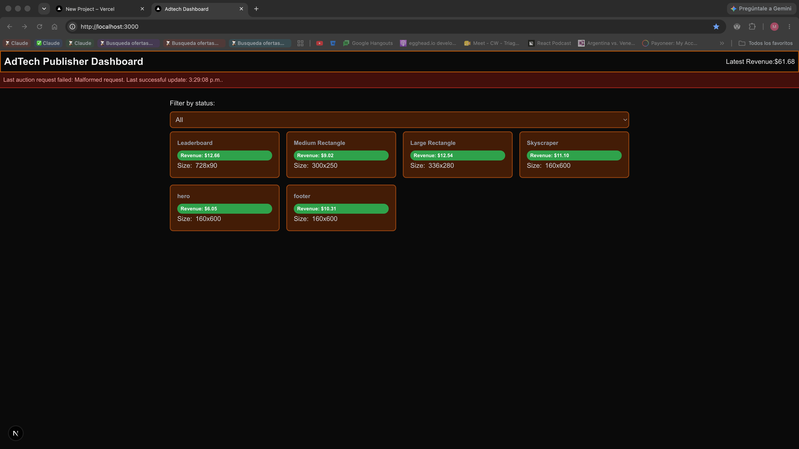

# AdTech Publisher Dashboard

A publisher-side dashboard that simulates header-bidding auctions for ad slots and shows their outcome and revenue in real time. Built as a practice project to apply modern Next.js, Tailwind and frontend system design on a domain I know from production AdTech work (Prebid.js, header bidding).

**Live demo:** 



## What it does

- Renders a responsive grid of ad slot cards from mock data.
- Runs a simulated auction per slot on the server, each with its own floor price and a 5-second timeout. Cards stream in as each auction finishes, behind a skeleton.
- Shows the result per slot (Winning, No Fill, Error).
- Filters slots by status through the URL (`/?status=winning`). Invalid values fall back to "All". Changing the filter keeps the current UI visible while the new one renders, and the select updates immediately.
- Cards use container queries, so they adapt to their own width rather than the viewport.

## Stack

| Area | Choice |
| --- | --- |
| Framework | Next.js 16 (App Router), React 19 |
| Language | TypeScript |
| Styling | Tailwind CSS 4, class-variance-authority for component variants |
| Data | Mock ad slots and simulated auctions (no real ad server calls) |

## Project structure

```
app/          routes and API handlers (page.tsx is an async Server Component)
components/   UI: slot cards, status filter (client island), typeahead
hooks/        useTypeAhead, useDebounce (typeahead only)
lib/          auctions, filter parsing, mock data
```

## Design decisions

- **Server Components first.** The page and the slot cards are async Server Components. Only the pieces that need browser interaction are client components ("islands"), such as the status filter and the typeahead.
- **One `<Suspense>` boundary per slot.** One slow auction doesn't block the rest of the grid, and the user sees skeletons that fill in as results arrive.
- **The filter lives in the URL.** The server reads `searchParams` (a Promise in this Next.js version) and validates it with `parseFilter`. The URL can be shared, reloaded and used with the back button. `StatusFilter` calls `router.replace` inside `useTransition`, and `useOptimistic` shows the selected value without waiting for the server.
- **Pure auction logic in `lib/auctions.ts`.** `resolveAuction` has no side effects and is easy to test. `runAuction` adds the simulated latency, and `getAuctionResult = cache(runAuction)` makes everything in one render share the same auction round per slot. This also keeps any component that aggregates results (such as the revenue total) consistent with the cards.
- **Container queries** instead of viewport breakpoints so a slot card works the same in any layout.

## Run it locally

```bash
npm install
npm run dev
```

Open http://localhost:3000.

## Known limitations and next steps

- Data is mocked; no real Prebid.js or ad server integration (see my [prebid-playground](https://github.com/martinnajleprogrammer/prebid-playground) for that side).
- **The filter is applied on the server, after each auction.** Cards that don't match disappear, so the grid reflows instead of leaving empty cells.
- **Each filter change or reload runs a new round of auctions.** `cache()` only lasts for a single render, so results aren't kept between requests. Results are random, which means the same slot can show a different outcome after changing the filter.
- **Revenue total (in progress).** It will be per round, not accumulated across refreshes. It will sum the CPM of every winning slot, including those hidden by the filter, because the filter is a view and doesn't change the round. It assumes a single currency; the mock bidders only use one, so it doesn't convert or validate currencies.
- The `/api/auctions` endpoint is kept for external calls, but the dashboard no longer uses it.
- The typeahead (`/api/search`) is built but temporarily unmounted from the page; it will come back to be covered by the E2E test.
- Planned: a client component that refreshes in the background without sending cards back to their skeleton, an error boundary for failed auctions, and Playwright E2E tests for the filter and search flows.
